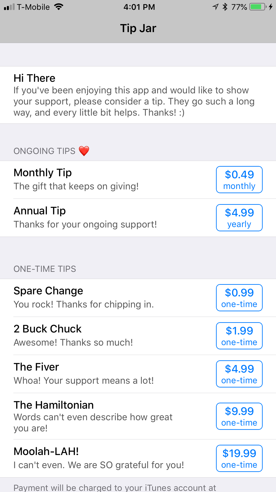

<!--
Copyright 2012-2018 Lionheart Software LLC

Licensed under the Apache License, Version 2.0 (the "License");
you may not use this file except in compliance with the License.
You may obtain a copy of the License at

   http://www.apache.org/licenses/LICENSE-2.0

Unless required by applicable law or agreed to in writing, software
distributed under the License is distributed on an "AS IS" BASIS,
WITHOUT WARRANTIES OR CONDITIONS OF ANY KIND, either express or implied.
See the License for the specific language governing permissions and
limitations under the License.
-->


[][lionheart-url]

<!-- [![CI Status][ci-badge]][travis-repo-url] -->
[![Version][version-badge]][cocoapods-repo-url]
[![License][license-badge]][cocoapods-repo-url]
[![Platform][platform-badge]][cocoapods-repo-url]

<!--
[![CocoaPods][downloads-badge]][cocoapods-repo-url]
[![CocoaPods][downloads-monthly-badge]][cocoapods-repo-url]
-->



## Installation

TipJarViewController is available through [CocoaPods](https://cocoapods.org). To install
it, simply add the following line to your Podfile:

```ruby
pod 'TipJarViewController'
```

### Usage

Before you can use TipJarViewController in your app, you'll first need to create a few IAPs in iTunes Connect--2 subscription IAPs and 5 one-time IAPs. This is currently a requirement but may change in the future.

Once you've created your IAPs, you just need to configure the header and description at the top of the view controller, and tell TipJarViewController what your IAP product identifiers are, using the `TipJarConfiguration` protocol. E.g.,

```swift
struct ExampleTipJarConfiguration: TipJarConfiguration {
    static var topHeader = "Hi There"

    static var topDescription = """
If you've been enjoying this app and would like to show your support, please consider a tip. They go such a long way, and every little bit helps. Thanks! :)
"""

    static func subscriptionProductIdentifier(for subscription: TipJarViewController<ExampleTipJarOptions>.SubscriptionRow) -> String {
        switch subscription {
        case .monthly: return "com.acme.app.TipJarSubscription.Monthly"
        case .yearly: return "com.acme.app.TipJarSubscription.Yearly"
        }
    }

    static func oneTimeProductIdentifier(for subscription: TipJarViewController<ExampleTipJarOptions>.OneTimeRow) -> String {
        switch subscription {
        case .small: return "com.acme.app.Tip.Small"
        case .medium: return "com.acme.app.Tip.Medium"
        case .large: return "com.acme.app.Tip.Large"
        case .huge: return "com.acme.app.Tip.Huge"
        case .massive: return "com.acme.app.Tip.Massive"
        }
    }

    static var termsOfUseURLString = "https://acme.app/terms.html"
    static var privacyPolicyURLString = "https://acme.app/privacy.html"
}
```

If you want more customization options, just make your configuration conform to `TipJarOptionalConfiguration`. You can also specify a URL running Lionheart's [receipt verifier](https://github.com/lionheart/in_app_purchase_receipt_verifier) to check for valid purchases on your own server.

```swift
extension ExampleTipJarConfiguration: TipJarOptionalConfiguration {
    static var title = "Tip Jar"
    static var oneTimeTipsTitle = "One-Time Tips"
    static var subscriptionTipsTitle = "Ongoing Tips ❤️"
    static var receiptVerifierURLString = "https://receipt-verifier.herokuapp.com/verify"
}
```

## License

TipJarViewController is available under the Apache 2.0 license. See the [LICENSE](LICENSE) file for more info.

<!-- Images -->

[ci-badge]: https://img.shields.io/travis/lionheart/TipJarViewController.svg?style=flat
[version-badge]: https://img.shields.io/cocoapods/v/TipJarViewController.svg?style=flat
[license-badge]: https://img.shields.io/cocoapods/l/TipJarViewController.svg?style=flat
[platform-badge]: https://img.shields.io/cocoapods/p/TipJarViewController.svg?style=flat
[downloads-badge]: https://img.shields.io/cocoapods/dt/TipJarViewController.svg?style=flat
[downloads-monthly-badge]: https://img.shields.io/cocoapods/dm/TipJarViewController.svg?style=flat

<!-- Links -->

[semver-url]: http://www.semver.org
[travis-repo-url]: https://travis-ci.org/lionheart/TipJarViewController
[cocoapods-url]: http://cocoapods.org
[cocoapods-repo-url]: http://cocoapods.org/pods/TipJarViewController
[doc-url]: https://code.lionheart.software/TipJarViewController/
[lionheart-url]: https://lionheartsw.com/

